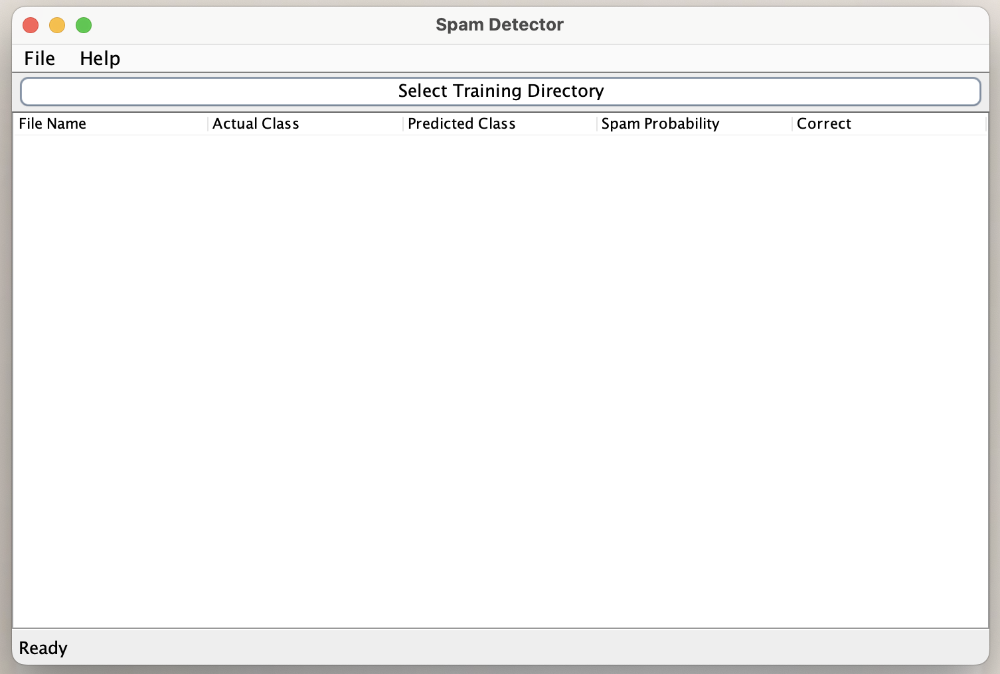
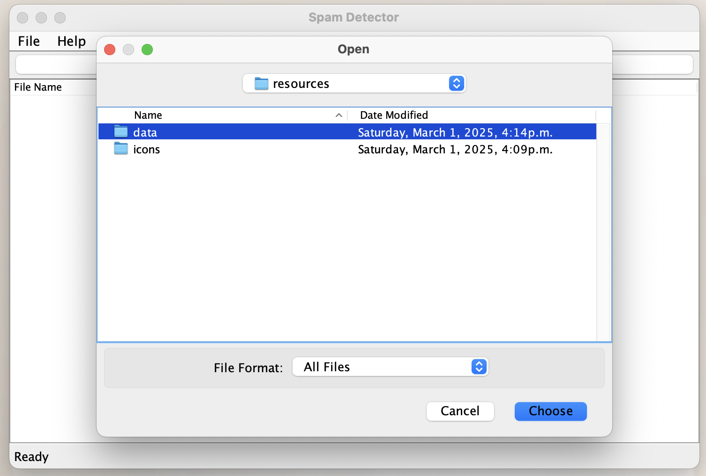
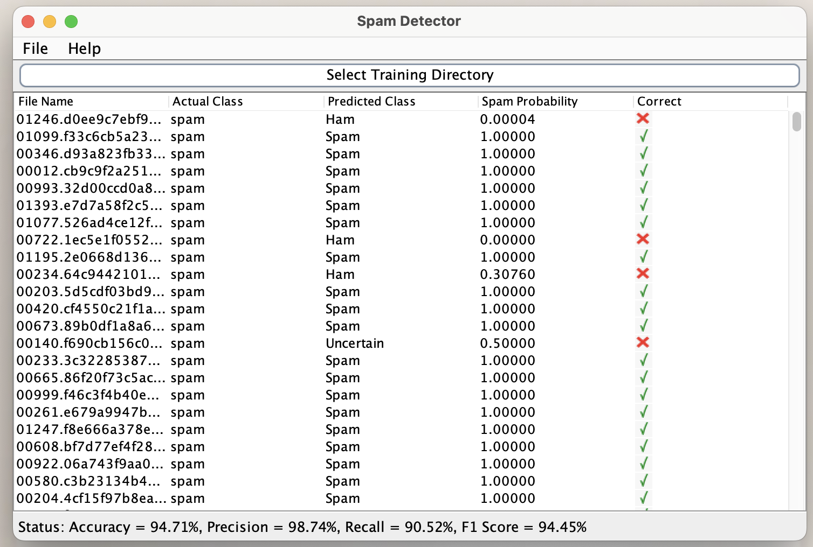
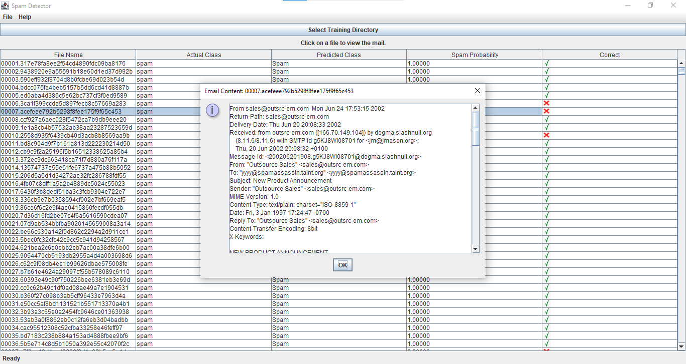

# Spam Detector
Jolly Soni, Jia Bernadette D Souza, Devishi Soni  
CSCI2020U: Software Systems Development & Integration

## Project Information

This project is a spam detection application that has been developed to identify and filter spam emails.
The application does so by analyzing the word frequencies in the emails provided labelled as either ham or spam. The
system then calculates the probabilities to determine the likelihood of an email being a spam. Some key features of the
application include:

1. **Training/Testing:** The application processes the labelled data and then proceeds to train the model and then evaluates its accuracy on the test data.
2. **Probability Calculation:** Uses Laplace Smoothing to calculate the spam probability.
3. **Graphical User Interface(GUI):** The application uses a Java-Swing based interface to allow the users to select their respective directory containing the data, and displays the actual and predicted outcomes of the spam detector in a table format using a J Table.
4. **Performance**: At the bottom of the running application the users will be able to see the precision and accuracy of the application, as well as the recall and f1 score.

Below are some screenshots of the application running:

    
      
    
  

## Improvements

To increase the readability and make our application more user-friendly, our group decided to add features that enhance usability and improve the user experience.

1) Visual Classification Indicators - We added a column to our table that visually demonstrates whether the spam detector's prediction was correct or incorrect. If correct, there is a green check mark icon; if incorrect, there is a red cross icon. This allows users to quickly see if the spam detector successfully categorized an email as spam or ham.

2) Click to View Email Content - Users can now click on any email entry in the table to open and view the full email content in a pop-up window. This improvement makes it easier for users to verify the classification results by checking the actual email content.

3) Potential Future Enhancements - Spam Filtering - Given more time, we would also add automated spam filtering, allowing the program to move detected spam emails to a separate folder automatically. This feature can be implemented in future updates to improve the usability of the spam detector.

## How To Run The Application

To successfully clone and run the application here are the steps the user must take:
1. Ensure that the computer in which the application will be run on has the following installed: Java, Git, and an IDE (ex. IntelliJ, VSCode, etc.)
2. Go onto the GitHub repository and copy its URL ([Link To Repository](https://github.com/OntarioTech-CS-program/w25-csci2020u-assignment01-a1-soni-soni-dsouza.git))
3. Open up the terminal and clone the repository using the following git command: git clone <your-repository-url>
4. Open the project in the IDE of your choice (may have to import as a Maven Project)
5. Navigate to the file called ***SpamDetectorGUI.java*** (src/main/java/csci2020u/assignment01)and run that file.
6. The user will be prompted to select their directory, they must navigate through their files and choose the folder named ***data***
7. Give the application a couple seconds to complete the training and testing and then the output should be displayed!

## Resources

https://en.wikipedia.org/wiki/Naive_Bayes_spam_filtering

https://en.wikipedia.org/wiki/Bag-of-words_model

